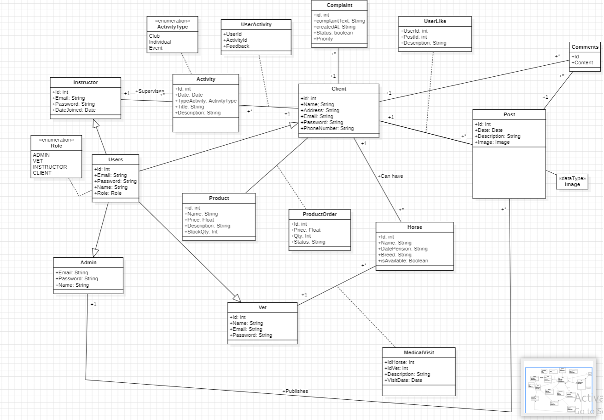

# PiDev-EquitationCenter
## Diagramme de classe

## Kanban Projects
- [Feature 2 - Samir](https://github.com/users/Samirtemtem/projects/2)
- [Feature 3 - Ahmed](https://github.com/users/Samirtemtem/projects/5)
- [Feature 4 - Ghaith](https://github.com/users/Samirtemtem/projects/3)

## Backlog

Le backlog est une liste hiérarchisée de fonctionnalités, d’améliorations et de corrections de bogues prévues pour un développement futur. Il donne un aperçu des prochaines étapes du projet.

### Feature 1: Gestion Des utilisateurs (Rima)

| ID User Story | User Story                                                                    | Priorité |
|---------------|-------------------------------------------------------------------------------|----------|
| 1.1           | En tant qu’admin, instructeur, client, vétérinaire je souhaite m’authentifier | 20       |
| 1.2           | En tant qu’client, je souhaite créer un compte                                | 15       |
| 1.3           | En tant qu’client, instructeur je souhaite consulter mon profil               | 9        |
| 1.4           | En tant qu’client, instructeur je souhaite modifier mes coordonnées           | 9        |
| 1.5           | En tant qu’client, instructeur je souhaite supprimer mes cordonnées           | 9        |
| 1.6           | En tant qu’admin, Je  souhaite gérer vétérinaires, instructeurs, les clients. | 9        |

### Feature 2: Gestion des activités (Samir)

| ID User Story | User Story                                                                        | Priorité |
|---------------|-----------------------------------------------------------------------------------|----------|
| 2.1           | En tant que admin, je souhaite gérer les activités                                | 30       |
| 2.2           | En tant que client, je souhaite réserver une activité                             | 40       |
| 2.3           | En tant que instructeur, je souhaite valider une activité                         | 15        |
| 2.4           | En tant que client, je souhaite consulter le calendrier des activités             | 15       |
| 2.5           | En tant qu’admin, je souhaite affecter une activité à un instructeur et un cheval | 20       |
| 2.6           | En tant qu’admin, je souhaite gérer les séances d'activité                        | 20       |

### Feature 3: Gestion chevaux (Ahmed)

| ID User Story | User Story                                    | Priorité |
|---------------|-----------------------------------------------|----------|
| 3.1           | En tant que vétérinaire, je souhaite suivre les profils des chevaux | 15       |
| 3.2           | En tant que vétérinaire, je souhaite suivre les soins médicaux des chevaux | 20       |
| 3.3           | En tant que vétérinaire, je souhaite gérer les disponibilités des chevaux à des activités | 30       |
| 3.4           | En tant que vétérinaire, je souhaite faire des visites médicales pour les chevaux | 15       |
| 3.5           | En tant que vétérinaire je peux suivre et effectuer des tests médicaux à travers la plateforme | 10       |
| 3.6           | En tant que vétérinaire je peux gérer les chevaux (Ajouter, modifier, supprimer) | 25       |

### Feature 4: Gestion store (Ghaith)

| ID User Story | User Story                                    | Priorité |
|---------------|-----------------------------------------------|----------|
| 4.1           | En tant que admin, je souhaite ajouter des produits | 30       |
| 4.2           | En tant que admin, je souhaite supprimer des produits | 25       |
| 4.3           | En tant que admin, je souhaite modifier des produits | 20       |
| 4.4           | En tant qu'administrateur, je souhaite accepter et supprimer une commande | 25       |
| 4.5           | En tant qu'client, je souhaite commander un produit | 30       |

### Feature 5: Gestion des actualités et pensions (Chaima)

| ID User Story | User Story                                                               | Priorité |
|---------------|--------------------------------------------------------------------------|----------|
| 5.1           | En tant qu’admin je peux publier, modifier et supprimer des actualités   | 25       |
| 5.2           | En tant qu’client je peux visualiser les actualités                      | 25       |
| 5.3           | En tant qu’client, je souhaite demander une pension                      | 15       |
| 5.4           | En tant qu'admin, je souhaite valider une demande de pension             |    15   |
| 5.5           | En tant qu'admin, je souhaite gérer les commentaires sur les actualitées |    15   |

